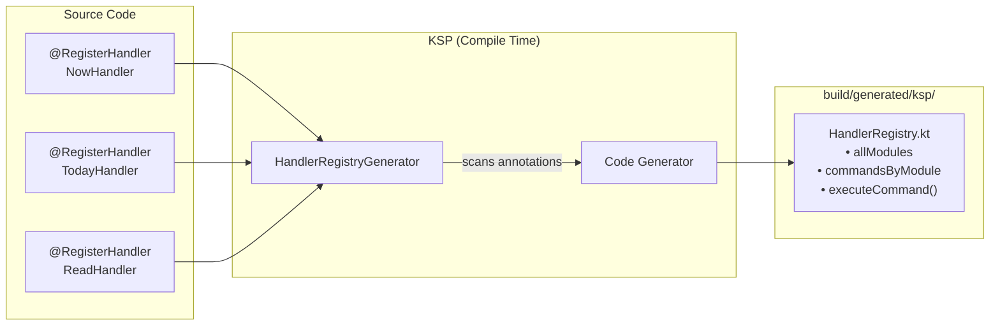
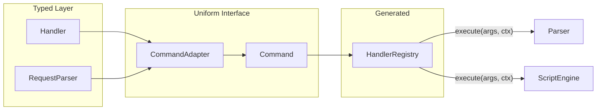
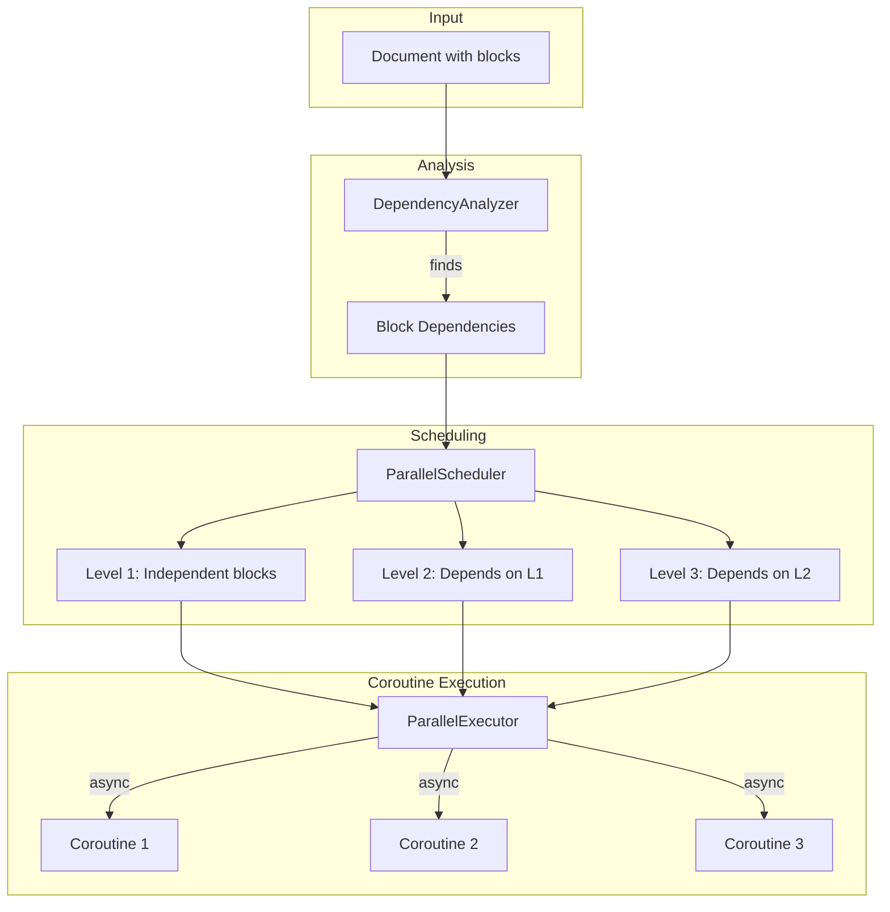
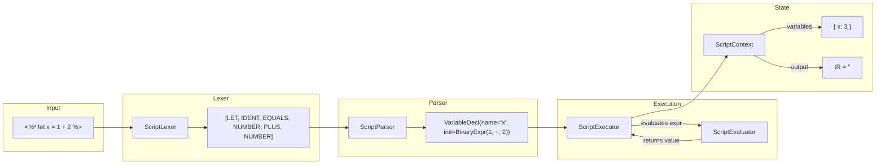
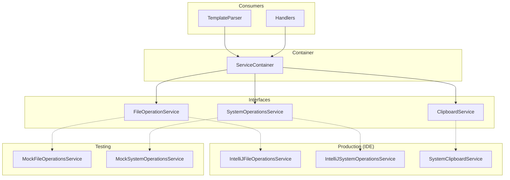
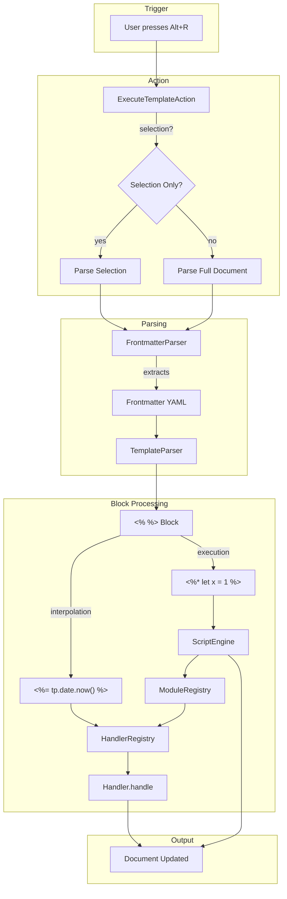
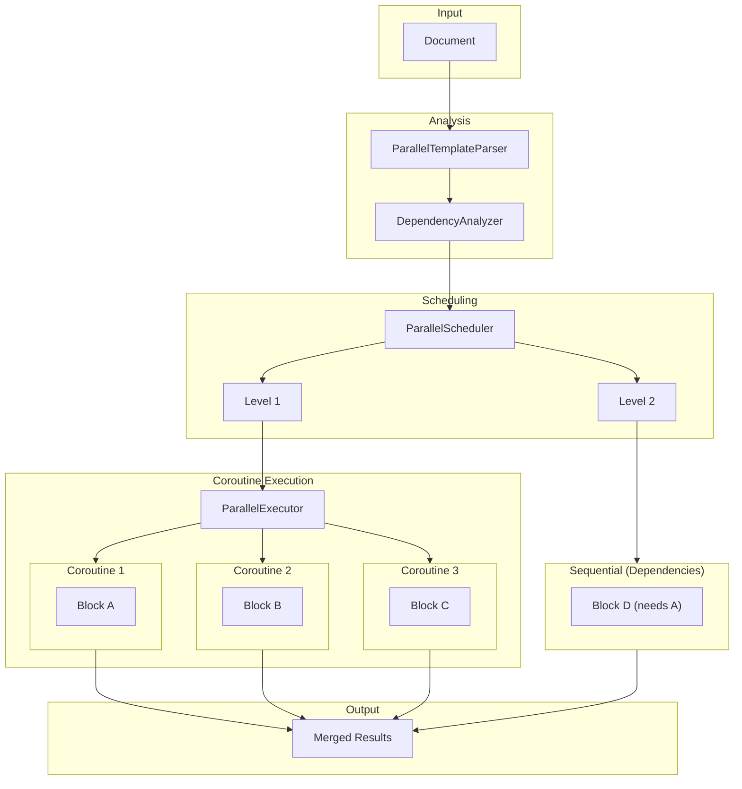

# Architecture Documentation

This document describes the internal structure and purpose of each file in the Templater plugin.

---

## Project Structure Overview

```
rider-plugin/
├── src/ksp-codegen/            # KSP annotation processor (separate module)
├── src/main/kotlin/ronsijm/templater/
│   ├── actions/                # IDE actions (menu items, shortcuts)
│   ├── completion/             # Code completion provider
│   ├── config/                 # IDE product configuration
│   ├── handlers/               # Handler-based command system + execution interface
│   │   ├── date/               # Date module handlers
│   │   ├── file/               # File module handlers
│   │   ├── system/             # System module handlers
│   │   └── web/                # Web module handlers
│   ├── modules/                # Non-handler modules (frontmatter, hooks, etc.)
│   ├── parallel/               # Experimental parallel execution
│   ├── parser/                 # Template parsing and validation
│   ├── script/                 # JavaScript-like script engine
│   ├── services/               # Abstraction layer for IDE/system operations
│   ├── settings/               # Plugin settings UI
│   └── utils/                  # Shared utilities
├── build/generated/ksp/        # KSP-generated code (HandlerRegistry)
└── docs/                       # Documentation
```

---

## Handler Registry Generator (KSP)

### `src/ksp-codegen/src/main/kotlin/.../codegen/HandlerRegistryGenerator.kt`
**KSP annotation processor** that scans for `@RegisterHandler` annotations and generates `HandlerRegistry.kt` at compile time. This enables automatic discovery of all command handlers without manual registration.



---

## Actions

### `actions/ExecuteTemplateAction.kt`
**Main IDE action** triggered by Alt+R (Rider) or Alt+Shift+R (IntelliJ). Handles:
- Full document execution
- Selection-only execution (can be disabled via "Execute current selection only" setting)
- Frontmatter preservation
- File rename/move operations after template execution

---

## Completion

### `completion/TemplateCompletionContributor.kt`
**IDE code completion provider**. Shows autocomplete suggestions when typing `tp.` in template blocks. Uses `HandlerRegistry` to dynamically provide completions for all registered handlers.

---

## Config

### `config/ProductConfig.kt`
**IDE product detection**. Determines if running in Rider or IntelliJ IDEA to adjust behavior (e.g., different keyboard shortcuts).

---

## Handlers

The handler system is the **primary way to add new template commands**. Each command has three files.

### Command Execution Interface

These define the **uniform execution contract** that allows the parser/script engine to call any command without knowing specific handler types:

| File | Purpose |
|------|---------|
| `Command.kt` | Interface: `execute(args: List<Any?>, context): String?` - uniform execution contract |
| `CommandExecutor.kt` | Interface for command execution logic |
| `CommandMetadata.kt` | Data class: name, description, example, parameters - for completion/docs |
| `CommandMetadataProvider.kt` | Interface for classes that provide metadata |
| `CommandAdapter.kt` | Adapts typed handlers to uniform `Command` interface |

**How it works:**



### Handler Infrastructure

| File | Purpose |
|------|---------|
| `CommandHandler.kt` | Interface all handlers implement: `handle(request, context): Result` |
| `CommandRequest.kt` | Base interface for request objects |
| `RegisterHandler.kt` | Annotation for auto-registration via KSP |
| `RequestParser.kt` | Interface for parsing `List<Any?>` arguments into typed request objects |
| `HandlerMetadata.kt` | Runtime metadata about handlers (description, examples) |
| `HandlerRegistration.kt` | Bundles handler + parser + metadata together |
| `ParamDescription.kt` | Annotation for documenting handler parameters |

### Handler Pattern (Example: `date/now`)

```
handlers/date/
├── NowHandler.kt        # Business logic: formats current date
├── NowRequest.kt        # Data class: { format: String? }
└── NowRequestParser.kt  # Parses "YYYY-MM-DD" → NowRequest
```

### Generated Code

| File | Purpose |
|------|---------|
| `build/generated/.../HandlerRegistry.kt` | **KSP-generated** registry of all handlers. Contains `executeCommand()`, `allModules`, `commandsByModule` |

---

## Modules

Non-handler modules that require special handling:

| File | Purpose |
|------|---------|
| `BaseModule.kt` | Abstract base class for modules |
| `FrontmatterModule.kt` | Access YAML frontmatter: `tp.frontmatter.title` |
| `HooksModule.kt` | Lifecycle hooks: `tp.hooks.on_open` |
| `ConfigModule.kt` | Runtime config: `tp.config.active_file` |
| `AppModule.kt` | Vault/app operations: `app.vault.create()` |
| `ModuleFactory.kt` | Creates module instances with context |

---

## Parallel Execution

When enabled in settings, the parallel executor can process independent template blocks concurrently for better performance. Uses **Kotlin coroutines** (`kotlinx.coroutines`) with `Dispatchers.Default` for concurrent execution.

| File | Purpose |
|------|---------|
| `ParallelTemplateParser.kt` | Main parallel parser entry point |
| `DependencyAnalyzer.kt` | Analyzes dependencies between template blocks |
| `ParallelExecutor.kt` | Executes independent blocks using coroutines (`async`/`awaitAll`) |
| `ParallelScheduler.kt` | Schedules blocks based on dependencies |
| `TemplateBlock.kt` | Represents a single `<% %>` or `<%* %>` block |



**Example:** If a document has blocks A, B, C where C depends on A's output:
- Level 1: A and B execute concurrently via `async`/`awaitAll`
- Level 2: C executes after A completes

### Handler Execution Categories

Handlers are classified into three categories that determine how they can be executed:

| Category | `pure` | `barrier` | `cancellable` | Description |
|----------|--------|-----------|---------------|-------------|
| **Pure** | ✅ | ❌ | ❌ | No side effects, can be parallelized freely |
| **Barrier** | ❌ | ✅ | ❌ | Has side effects, requires sequential execution |
| **Cancellable** | ❌ | ❌ | ✅ | Requires user interaction, forces sequential execution |
| **Default** | ❌ | ❌ | ❌ | May have side effects but doesn't block parallelism |

**Pure Functions** (`pure = true`)
- Only read data, never modify state
- Can be safely executed in parallel with other pure functions
- Examples: `tp.date.now()`, `tp.file.title()`, `tp.file.content()`, `tp.frontmatter.*`

**Barrier Functions** (`barrier = true`)
- Modify state (files, clipboard, cursor position)
- Must execute sequentially to ensure correct ordering
- Examples: `tp.file.create_new()`, `tp.file.move()`, `tp.file.rename()`, `tp.system.clipboard()`, `tp.file.cursor()`

**Cancellable Functions** (implements `CancellableHandler`)
- Show dialogs or prompts that require user interaction
- User can cancel the operation (e.g., close dialog)
- Always treated as barriers (sequential execution)
- Examples: `tp.system.prompt()`, `tp.system.suggester()`

**Default Functions** (none of the above)
- May have minor side effects but don't require strict ordering
- Can potentially be parallelized with caution

These properties are set via the `@RegisterHandler` annotation:
```kotlin
@RegisterHandler(
    module = "file",
    description = "Creates a new file",
    example = "create_new('content', 'file.md')",
    pure = false,    // default
    barrier = true   // has side effects
)
class CreateNewHandler : CommandHandler<CreateNewRequest, String> { ... }
```

The `cancellable` property is auto-detected when a handler implements the `CancellableHandler` interface.

---

## Parser

| File | Purpose |
|------|---------|
| `TemplateParser.kt` | **Main parser**. Finds `<% %>` blocks, routes to handlers/modules, handles whitespace control |
| `FrontmatterParser.kt` | Parses YAML frontmatter at document start (`---` delimited) |
| `TemplateContext.kt` | Context passed to all handlers: frontmatter, file info, services |
| `TemplateValidator.kt` | Validates template syntax before execution |
| `TemplateExecutionException.kt` | Exception with helpful error messages |
| `TemplateValidationException.kt` | Validation-specific exception |
| `ValidationError.kt` | Structured validation error data |

---

## Script Engine

The script engine executes JavaScript-like code in `<%* %>` blocks.



| File | Purpose |
|------|---------|
| `ScriptEngine.kt` | **Main entry point**. Orchestrates lexing, parsing, execution |
| `ScriptLexer.kt` | Tokenizes script text into tokens (keywords, operators, strings, etc.) |
| `ScriptParser.kt` | Parses tokens into AST nodes (statements, expressions) |
| `ScriptExecutor.kt` | Executes AST nodes (if/else, for loops, try/catch, etc.) |
| `ScriptEvaluator.kt` | Evaluates expressions (arithmetic, comparisons, method calls) |
| `ScriptContext.kt` | Mutable state during execution: variables, `tR` accumulator |
| `ModuleRegistry.kt` | Routes `tp.module.function()` calls to handlers in script blocks |

### Supported Features
- Variables: `let`, `const`, `var`
- Control flow: `if/else`, `for`, `for-of`, `try/catch/finally`
- Functions: Arrow functions (`x => x * 2`), array methods (`.map()`, `.filter()`)
- Strings: Template literals, `.trim()`, `.split()`, `.join()`, `.padStart()`, `.substring()`, `.replaceAll()`
- Objects: Object literals `{ key: value }`

---

## Services

Abstraction layer for testability. Each service has:
- **Interface**: Defines operations
- **IntelliJ implementation**: Real IDE operations
- **Mock/Null implementation**: For testing



| File | Purpose |
|------|---------|
| `ServiceContainer.kt` | Holds all service instances |
| **System Operations** | |
| `SystemOperationsService.kt` | Interface: prompts, dialogs |
| `IntelliJSystemOperationsService.kt` | Real: uses IntelliJ dialogs |
| `MockSystemOperationsService.kt` | Test: returns predefined values |
| `NullSystemOperationsService.kt` | No-op implementation |
| **File Operations** | |
| `FileOperationService.kt` | Interface: file CRUD, metadata |
| `IntelliJFileOperationsService.kt` | Real: uses VirtualFile API |
| `MockFileOperationsService.kt` | Test: in-memory file system |
| `NullFileOperationService.kt` | No-op implementation |
| **Other Services** | |
| `ClipboardService.kt` | Interface for clipboard |
| `SystemClipboardService.kt` | Real clipboard implementation |
| `HttpService.kt` | HTTP request utilities |

---

## Settings

| File | Purpose |
|------|---------|
| `TemplaterSettings.kt` | Persistent settings state (parallel execution, stats, validation) |
| `TemplaterSettingsConfigurable.kt` | Settings UI panel in IDE preferences |

---

## Utils

| File | Purpose |
|------|---------|
| `ArgumentParser.kt` | Parses function arguments from strings |
| `CommandExecutionHelper.kt` | Helper for executing module commands |
| `DateFormats.kt` | Date format pattern utilities |
| `ErrorMessages.kt` | Centralized error message strings |
| `Logging.kt` | Logging utilities |
| `ModuleNames.kt` | Module name constants |
| `TemplateConstants.kt` | Template syntax constants (`<%`, `%>`, etc.) |

---

## Data Flow

### Sequential Execution (Default)



### Parallel Execution (When Enabled)



---

## Adding a New Command

1. Create handler files in `handlers/<module>/`:
   - `XxxHandler.kt` - implements `CommandHandler<XxxRequest, ReturnType>`
   - `XxxRequest.kt` - data class with parameters
   - `XxxRequestParser.kt` - implements `RequestParser<XxxRequest>`

2. Add `@RegisterHandler` annotation to handler class

3. Run build - KSP generates updated `HandlerRegistry.kt`

4. Command is automatically available as `tp.<module>.<command>()`
